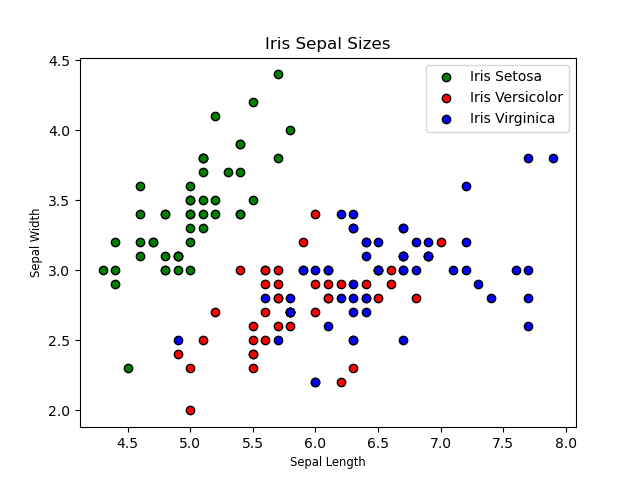
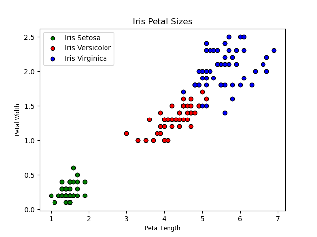

# Iris Database Project

The iris dataset is a dataset that contains fifty entries of data for the petal length, petal width, sepal length and sepal width from three different types of Iris flower (Iris setosa, Iris versicolor and Iris virginica).

The explanation for the code used to analyse the Iris dataset can be found below.

The pandas module was used to read the dataset that was provided in a .csv(comma-separated values) document using the read_csv function of the module and assigned to the variable iris_df. For the data columns a variable containing a list of columns names was created following the description on [UCI Machine Learning Repository - Iris Dataset](https://archive.ics.uci.edu/ml/datasets/iris), which shows what each column from the csv document represents, and set as iris_df.columns, the data frame columns

To print the summary of the variables the function .describe() was used, however as it returned values with different decimal lengths. I was also used the .applymap() to apply a function to the database and a lambda function was used to add formatting to the output, setting it to 3 decimal spaces f"{x:0.3f}" .

Before starting with the plots more preparation was done to the database. The .loc function from the Pandas module was used on the column “class” from the data frame to locate each occurrence os each type of Iris flower and store it in a variable. For example, using the .loc on the Class column to search for the string “Iris-virginica” will return all the lines where the flower class is Iris-virginica, by doing we can break down the information in the database in smaller parts making it easier use when plotting the information.

For the plots, a plots module was created to host all the code related to the plots. This file named plots_file.py contains the code for all the plots used and the plots were created using the matplotib.plyplot module.
The plots created are four histogram plots one for each of the Iris flowers attributes ( petal length, petal width, sepal length and sepal width). All the four histogram plots use the same plot style and the code is identical for them.

The plots were made into functions that takes one argument,  iris_df[“name of the column”]. The plots.sepal_length_hist function takes iris_df['Sepal length'] as argument and so on. 
After that there is a. clf() function from matplotib.plyplot for clearing the figure generated by the previous plots so the plots do not overlap each other, also used .context with the “with” keyword to force apply the plot style to the whole plot, instead of using style.use as it was making the plot styles not to be applied after the first plot was generated.

The number of bins for the histogram plot was set to nine and the color edge for the bins to black to make it easier to see each bin. After that the title, x and y labels were set, a mean line was created and stylised using. axvline to add a little bit more of information to the plot and finally the plot was saved as a PNG.

For the Scatter plots the data was divided by type of flower and was ploted on one plot per pair of attribute.  Each type of Iris was given a different color in the plot and legends were add to identify them. By looking at the scatter plot it becomes easier to identify the differences between the flowers. For example, Iris Setosa is the one with the smaller petal sizes, both length and width, while Iris Virginica has the biggest petal size of the three types.
Regarding sepal sizes, as it can be seem in the Scatter Septal plot the widest sizes are of often seen in the Iris Setosa while the lengthiest ones are seen in the Iris Virginica. For both petal and sepal sizes the Iris Versicolor seems to be the middle one regarding sizes.

Below are the scatter plots and pictures of the flowers so we can see the plots translated to real life examples:

